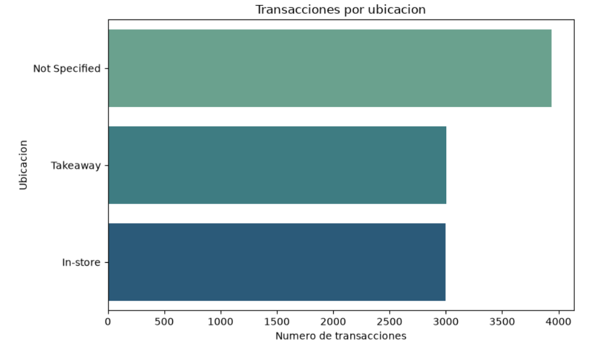
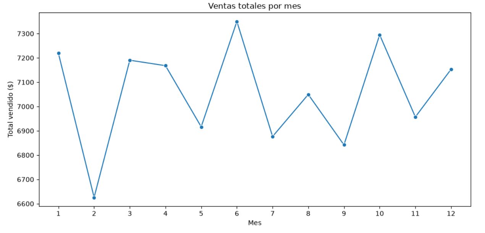

# ☕ Análisis y Limpieza de Datos: Ventas de Cafetería


🔗 **[Ver dashboard en vivo](https://cafe-sales-data-cleaning-amylyg7jf7zpqvgrgdfv2d.streamlit.app)** | 📓 [Ver notebooks de análisis](notebooks/)

Proyecto de ciencia de datos que transforma un dataset sintético "sucio" de 10,000 transacciones en un análisis limpio y accionable, aplicando un flujo completo de limpieza, análisis exploratorio (EDA) y generación de insights de negocio.


## 📋 Contexto del proyecto

El dataset original ([Dirty Cafe Sales - Kaggle](https://www.kaggle.com/datasets/ahmedmohamed2003/cafe-sales-dirty-data-for-cleaning-training)) fue diseñado intencionalmente con valores nulos, errores ("ERROR"/"UNKNOWN") e inconsistencias, simulando un escenario realista de datos de ventas mal capturados. El objetivo de este proyecto es demostrar un flujo de trabajo profesional de principio a fin: desde datos poco confiables hasta insights listos para tomar decisiones.

## 🎯 Objetivos

- Diagnosticar y documentar los problemas de calidad en los datos
- Aplicar estrategias de limpieza justificadas (no solo eliminar, sino recuperar información cuando es posible)
- Explorar los datos para identificar patrones relevantes
- Comunicar hallazgos en un lenguaje claro, orientado a decisiones de negocio

## 🛠️ Herramientas utilizadas

- **Python 3** — lenguaje principal
- **Pandas** — limpieza y manipulación de datos
- **Matplotlib / Seaborn** — visualización de datos
- **Streamlit** — dashboard interactivo
- **Jupyter Notebook** — entorno de análisis
- **Git / GitHub** — control de versiones

## 📁 Estructura del repositorio

```
cafe-sales-data-cleaning/
├── data/
│   ├── dirty_cafe_sales.csv       # Dataset original (sucio)
│   └── cafe_sales_clean.csv       # Dataset limpio, listo para análisis
├── notebooks/
│   ├── 01_primer_vistazo.ipynb        # Exploración inicial y diagnóstico
│   ├── 02_limpieza_datos.ipynb        # Proceso completo de limpieza
│   ├── 03_analisis_exploratorio.ipynb # EDA y visualizaciones
│   └── 04_insights_finales.ipynb      # Resumen ejecutivo de hallazgos
├── images/                        # Gráficas exportadas para este README
├── src/                           # Funciones de limpieza reutilizables
├── tests/                         # Tests unitarios del proceso de limpieza
├── dashboard.py                   # App de Streamlit
├── requirements.txt               # Librerías necesarias
└── README.md
```

## 🔍 Proceso de limpieza (resumen)

El dataset original mezclaba tres tipos distintos de "dato faltante" que había que tratar de forma diferenciada:

1. **Estandarización**: los valores `"ERROR"` y `"UNKNOWN"` se convirtieron a `NaN` real, para que pandas los reconociera como datos faltantes genuinos.
2. **Recuperación matemática**: dado que `Total Spent = Quantity × Price Per Unit`, se recuperaron cerca de **500 valores numéricos** despejando la fórmula en cualquiera de sus tres variables, en lugar de eliminarlos.
3. **Imputación categórica explícita**: los nulos en `Item`, `Payment Method` y `Location` se rellenaron con la etiqueta `"Not Specified"`, preservando filas con datos de venta válidos sin inventar información.
4. **Eliminación selectiva**: solo se eliminaron ~40 filas (0.4% del dataset) donde era matemáticamente imposible recuperar los datos de venta.
5. **Conservación de fechas nulas**: 457 filas sin fecha se conservaron para análisis no temporales, y se excluyen únicamente en análisis de series de tiempo.

📓 Ver el proceso completo y las decisiones justificadas en [`02_limpieza_datos.ipynb`](notebooks/02_limpieza_datos.ipynb)

## 📊 Hallazgos principales

### Calidad de datos desigual entre columnas

`Location` (~40%) y `Payment Method` (~32%) presentan tasas de dato faltante mucho más altas que `Item` (~10%), sugiriendo fallas sistemáticas específicas en la captura de esos campos.



### Ventas estables, sin estacionalidad marcada

Las ventas mensuales varían menos del 10% a lo largo del año, sin tendencia de crecimiento ni patrón estacional evidente.



### Otros hallazgos

- Los 8 productos tienen volúmenes de venta muy parejos, sin un "producto estrella" dominante.
- El ticket promedio es de **$8.93** (mediana $8.0), con consistencia entre transacciones.

📓 Ver el análisis completo en [`03_analisis_exploratorio.ipynb`](notebooks/03_analisis_exploratorio.ipynb) y el resumen ejecutivo en [`04_insights_finales.ipynb`](notebooks/04_insights_finales.ipynb)

## 📊 Dashboard interactivo

🔗 **[Abrir dashboard en vivo](https://cafe-sales-data-cleaning-amylyg7jf7zpqvgrgdfv2d.streamlit.app)**

El proyecto incluye un dashboard construido con Streamlit para explorar los datos de forma interactiva, con filtros por producto, método de pago y ubicación.

Para ejecutarlo localmente:

```bash
streamlit run dashboard.py
```

## ⚠️ Limitaciones

Este es un dataset **sintético**, generado intencionalmente para practicar limpieza de datos. Los patrones (o ausencia de ellos) no deben interpretarse como comportamiento real de consumidores. El valor de este proyecto está en demostrar un flujo de limpieza y análisis riguroso y bien documentado, aplicable a datos reales.

## 🚀 Cómo reproducir este proyecto

```bash
# Clona el repositorio
git clone https://github.com/Ma-Daniela3224/cafe-sales-data-cleaning.git
cd cafe-sales-data-cleaning

# Crea y activa un entorno virtual
python -m venv venv
source venv/bin/activate  # En Windows: venv\Scripts\activate

# Instala las dependencias
pip install -r requirements.txt

# Abre los notebooks en orden
jupyter notebook
```

## ✅ Tests

El proceso de limpieza cuenta con tests unitarios que verifican el comportamiento de cada función de forma aislada.

```bash
python -m pytest tests/ -v
```

---

⭐ Si este proyecto te resultó útil o interesante, considera darle una estrella al repositorio.